# InvoiceMe - Complete Architecture Diagrams

## 1. High-Level System Architecture

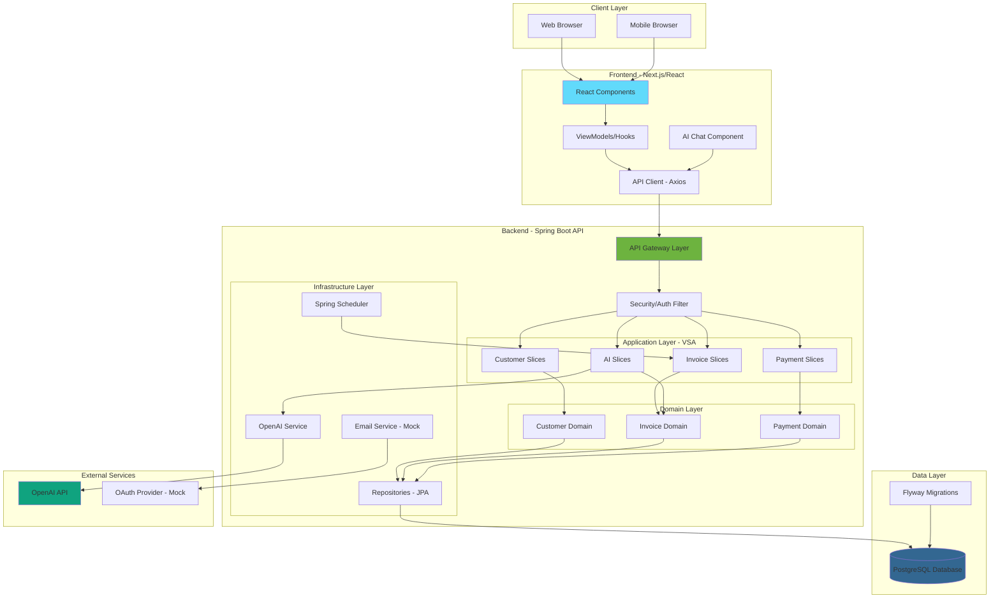

## 2. Backend Architecture - Vertical Slice Architecture with CQRS

```mermaid
graph TB
    subgraph "API Controllers"
        CustomerCtrl[CustomerController]
        InvoiceCtrl[InvoiceController]
        PaymentCtrl[PaymentController]
        AICtrl[AIController]
    end

    subgraph "Customer Vertical Slice"
        subgraph "Commands"
            CreateCust[CreateCustomerCommand]
            UpdateCust[UpdateCustomerCommand]
            DeleteCust[DeleteCustomerCommand]
        end

        subgraph "Queries"
            GetCust[GetCustomerQuery]
            ListCust[ListCustomersQuery]
        end

        subgraph "Handlers"
            CreateCustH[CreateCustomerHandler]
            GetCustH[GetCustomerHandler]
        end
    end

    subgraph "Invoice Vertical Slice"
        subgraph "Commands "
            CreateInv[CreateInvoiceCommand]
            SendInv[SendInvoiceCommand]
            CancelInv[CancelInvoiceCommand]
            UpdateInv[UpdateInvoiceCommand]
        end

        subgraph "Queries "
            GetInv[GetInvoiceQuery]
            ListOverdue[ListOverdueQuery]
            GetByStatus[GetByStatusQuery]
        end

        subgraph "Handlers "
            CreateInvH[CreateInvoiceHandler]
            SendInvH[SendInvoiceHandler]
            GetInvH[GetInvoiceHandler]
        end
    end

    subgraph "Payment Vertical Slice"
        subgraph "Commands  "
            RecordPay[RecordPaymentCommand]
        end

        subgraph "Queries  "
            GetPay[GetPaymentQuery]
            ListPayHist[ListPaymentHistoryQuery]
        end

        subgraph "Handlers  "
            RecordPayH[RecordPaymentHandler]
            GetPayH[GetPaymentHandler]
        end
    end

    subgraph "AI Vertical Slice"
        subgraph "Commands   "
            GenReminder[GenerateReminderCommand]
            ProcessChat[ProcessChatCommand]
        end

        subgraph "Handlers   "
            GenReminderH[GenerateReminderHandler]
            ProcessChatH[ProcessChatHandler]
        end
    end

    subgraph "Domain Models"
        Customer[Customer Entity]
        Invoice[Invoice Aggregate]
        LineItem[LineItem Value Object]
        Payment[Payment Entity]
    end

    subgraph "Infrastructure"
        CustRepo[(Customer Repository)]
        InvRepo[(Invoice Repository)]
        PayRepo[(Payment Repository)]
        OpenAISvc[OpenAI Service]
    end

    CustomerCtrl --> CreateCust
    CustomerCtrl --> GetCust
    CreateCust --> CreateCustH
    GetCust --> GetCustH

    InvoiceCtrl --> CreateInv
    InvoiceCtrl --> SendInv
    InvoiceCtrl --> GetInv
    CreateInv --> CreateInvH
    SendInv --> SendInvH
    GetInv --> GetInvH

    PaymentCtrl --> RecordPay
    PaymentCtrl --> GetPay
    RecordPay --> RecordPayH
    GetPay --> GetPayH

    AICtrl --> GenReminder
    AICtrl --> ProcessChat
    GenReminder --> GenReminderH
    ProcessChat --> ProcessChatH

    CreateCustH --> Customer
    CreateInvH --> Invoice
    RecordPayH --> Payment
    RecordPayH --> Invoice

    Customer --> CustRepo
    Invoice --> InvRepo
    Payment --> PayRepo
    Invoice --> LineItem

    GenReminderH --> OpenAISvc
    ProcessChatH --> OpenAISvc
    ProcessChatH --> InvRepo

    style CreateCust fill:#ffd700
    style GetCust fill:#87ceeb
    style CreateInv fill:#ffd700
    style GetInv fill:#87ceeb
    style RecordPay fill:#ffd700
    style GetPay fill:#87ceeb
```

## 3. Domain Model - Entity Relationships

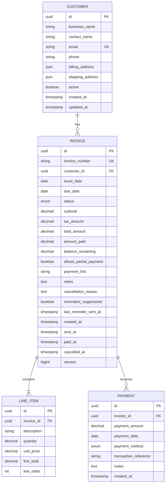

## 4. Invoice Lifecycle State Machine

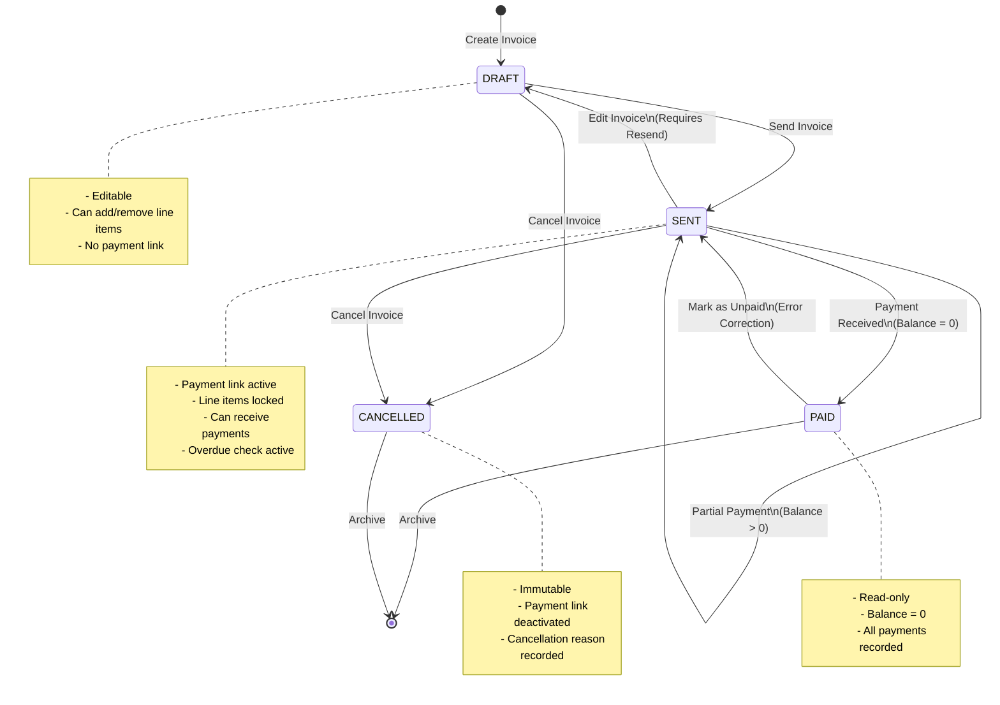

## 5. Create and Send Invoice Flow

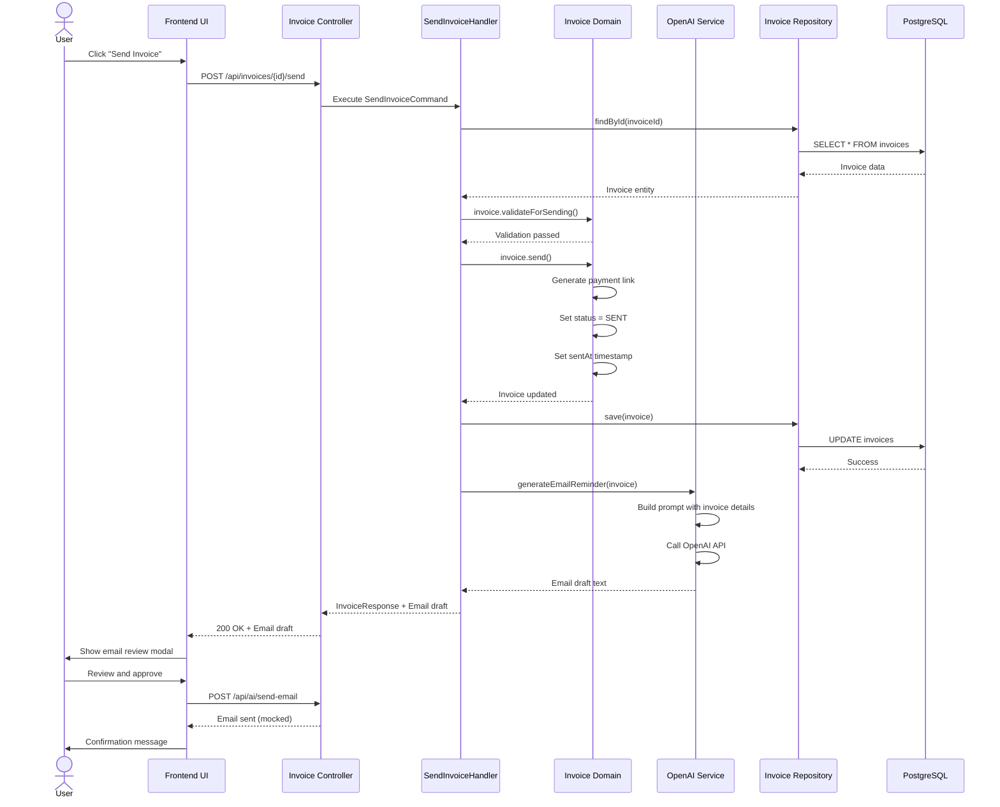

## 6. Record Payment Flow with Idempotency

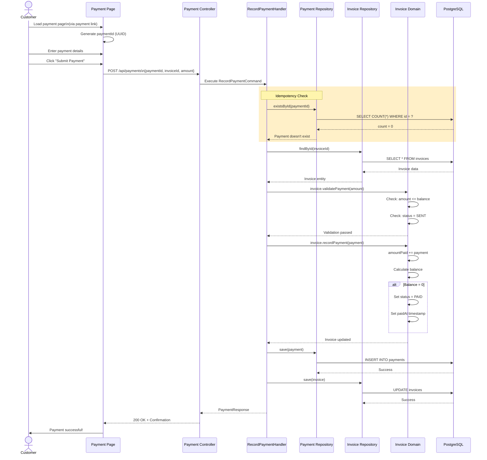

## 7. AI Chat Assistant Flow - Function Calling

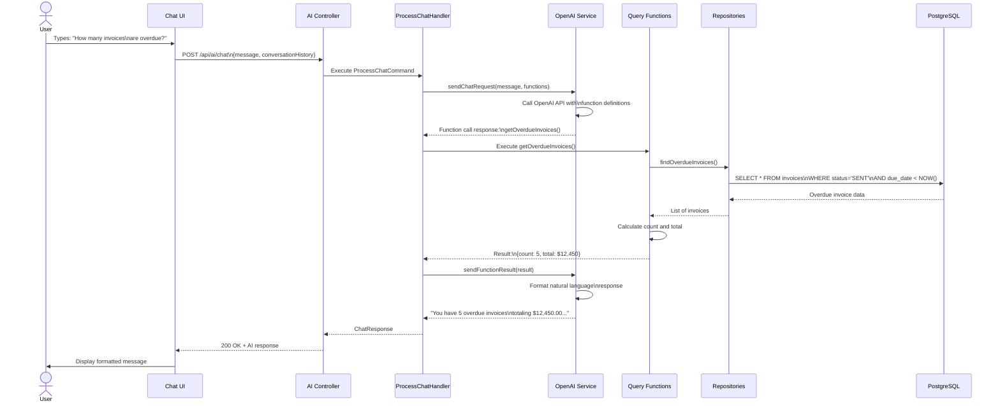

## 8. Scheduled Overdue Invoice Check

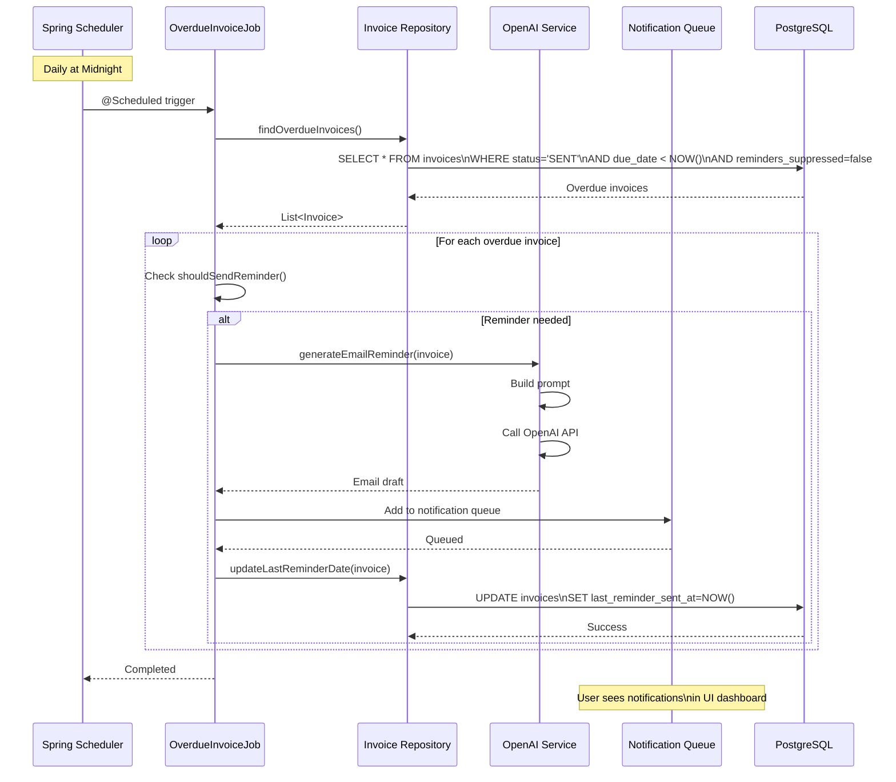

## 9. Complete Technology Stack Diagram

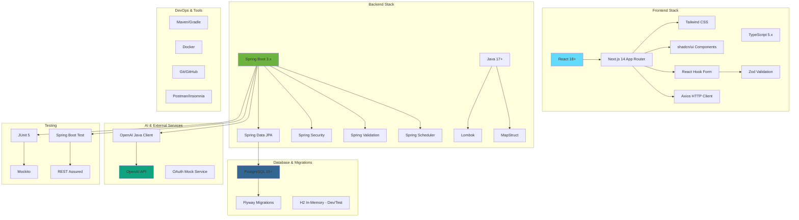

## 10. Deployment Architecture - AWS

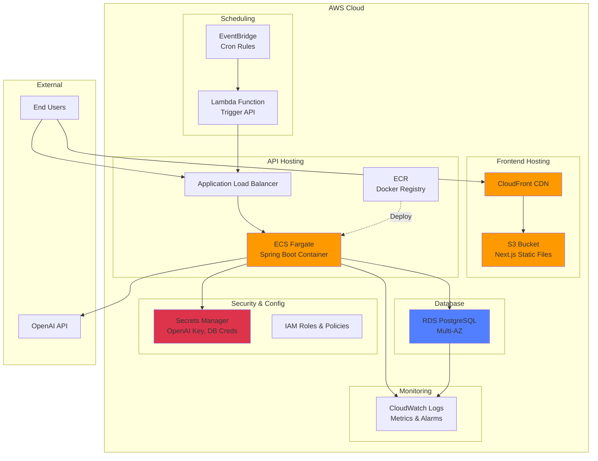

## 11. Data Flow - Complete Invoice-to-Payment Journey

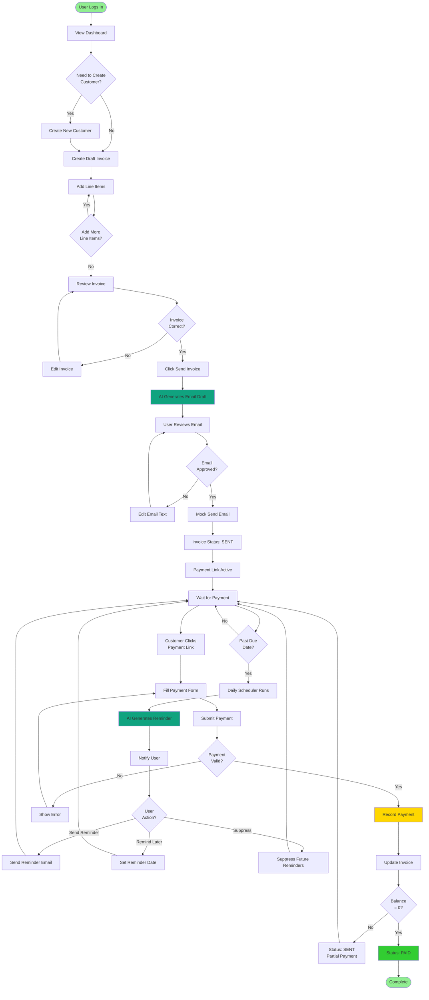

## 12. CQRS Pattern Implementation Detail

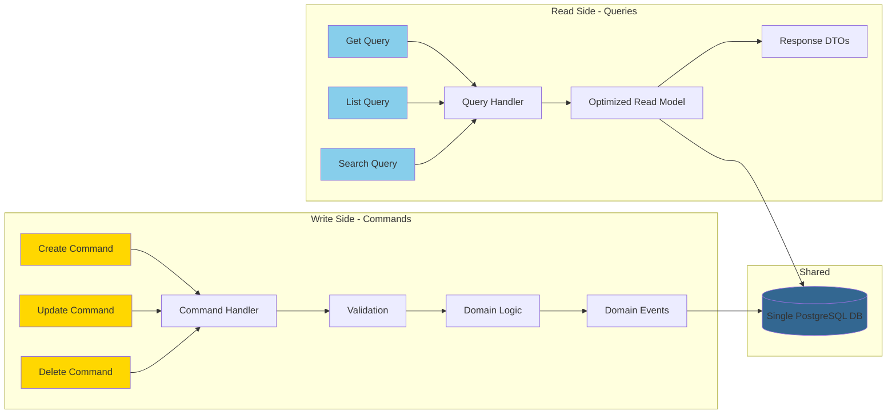

---

## Diagram Usage Guide

### Viewing These Diagrams

1. **In GitHub:** Diagrams render automatically in markdown preview
2. **In VS Code:** Install "Markdown Preview Mermaid Support" extension
3. **Online:** Copy diagram code to [Mermaid Live Editor](https://mermaid.live/)
4. **In Documentation:** Use these in your technical write-up

### Diagram Purposes

- **Diagram 1:** Overview for stakeholders and initial planning
- **Diagram 2:** Development guide for backend implementation
- **Diagram 3:** Database schema reference
- **Diagram 4:** Business logic reference for invoice states
- **Diagrams 5-8:** Implementation guides for specific features
- **Diagram 9:** Technology selection reference
- **Diagram 10:** Deployment planning
- **Diagram 11:** End-to-end business process
- **Diagram 12:** CQRS pattern implementation guide

### Exporting Diagrams

To export as images for presentations:

1. Visit [Mermaid Live Editor](https://mermaid.live/)
2. Paste diagram code
3. Click "Download" → PNG/SVG

---

**Note:** These diagrams are comprehensive representations of the InvoiceMe architecture as defined in PRD v2.0. Use them as reference during development and include them in your technical documentation deliverable.
